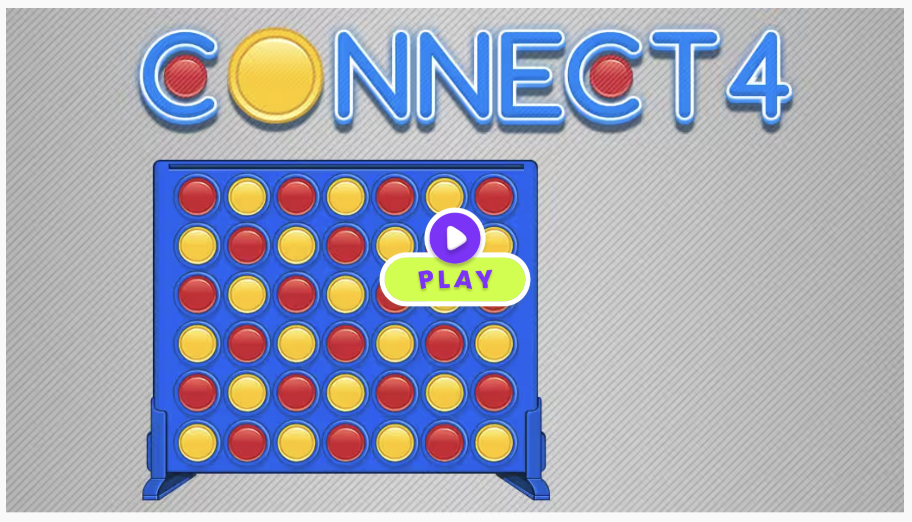
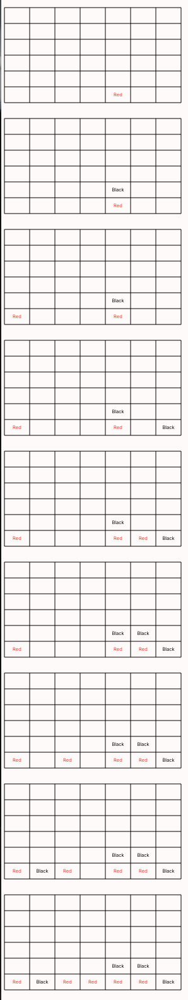

# Connect-Four-Modeling
Modeling the chess game "connect four" using formal method

## Project Objective

Connect Four is a fun game for two players. The goal is to be the first to line up four of your own colored discs in a row. Picture a vertical grid with six rows and seven columns—it's like a standing frame. Players take turns dropping their colored discs into any column, and the disc falls down to the lowest empty spot. The winner is the first person to get four of their discs in a row, whether it's up and down, side to side, or diagonally.



Note that for clear visualization, we use red and black as colors.

## Model Design and Visualization

### Model Design Choices

The general model design is similar a board game with 2 players who take turns to play. The main difference of Connect4 with other board games are the board shapes,  valid moving positions, and winning conditions. We addressed these key features in Board signature and winning and move predicates. As this game is played by turns, we model the gaming procedure in a linear trace with moving transitions.

### Run Statements

Currently in the code, the run statement is run a game trace which would (if given a ufficient number of boards) give a game trace which shows one winner. We use ```next is linear``` to have a linear trace.

### Visualization

We wrote a customized javascript file to show every step of our game and can be directly run. Note that due to the web browser compatibility, you may need to use "command" and "-" to zoom out of the browser page to see all of the results. Here is a demonstration of a Red winning game with 10 boards.



## Signatures and Predicates

- Signatures:
    - The game has two players, namely Red and Black which take turn to move. 
    - A 6*7 board.

- Predicates:
  - Wellformed: whether the board is in a valid state with no invalid index
  - Initial: the initial state should be an empty board
  - Red turn and black turn: Red moves first and then black moves.
  - Balanced: the moves of Red and Black should be balanced.
  - Winning: Win under the following 4 conditions:
    - 4 consecutive same color in a row
    - 4 consecutive same color in a column
    - 4 consecutive same color in a diagonal direction
  - Move: A valid move should have valid guards and post conditions
  - Do nothing: if the game is already win, then no players should move.
  - Game trace: From a valid initial state, the plapers take turns to play the game

## Testing

We wirte tests for both positive and negative cases, testing for underconstraint and over constraint situations. We test for all predicates we wrote in ```connect-four.frg```. For each predicate, we test whether this predicate can actually constraint what it is supposed to constraint (using ```assert ... is necessary``` for the underconstraint test), as well as whether this predicate does not constraint anything that it should not constraint (using ```assert ... is sufficient``` for the overconstraint test). All of our tests are detailedly annotated.
